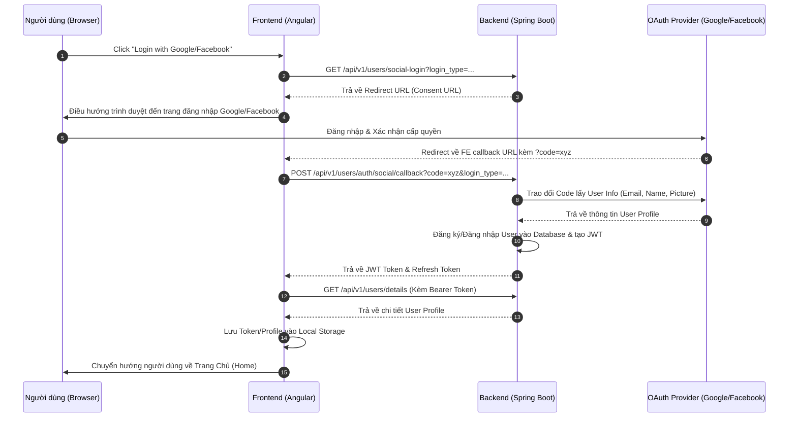
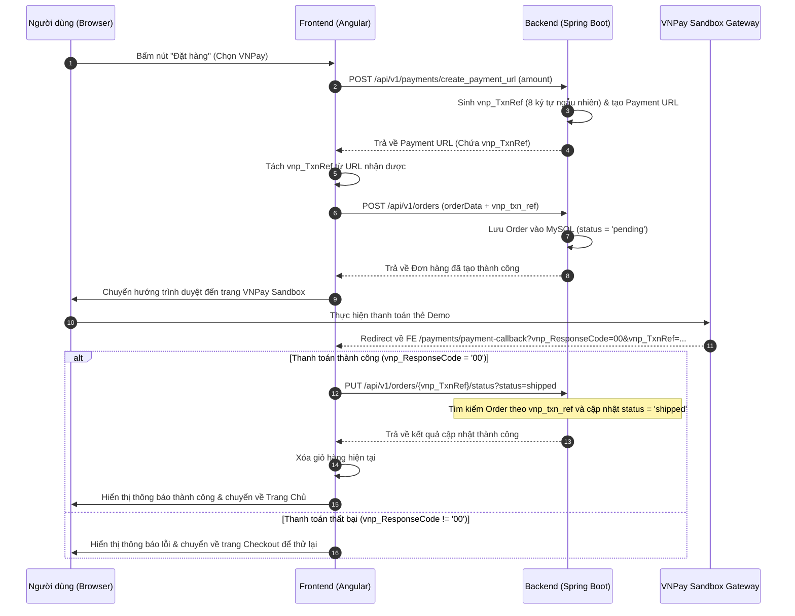
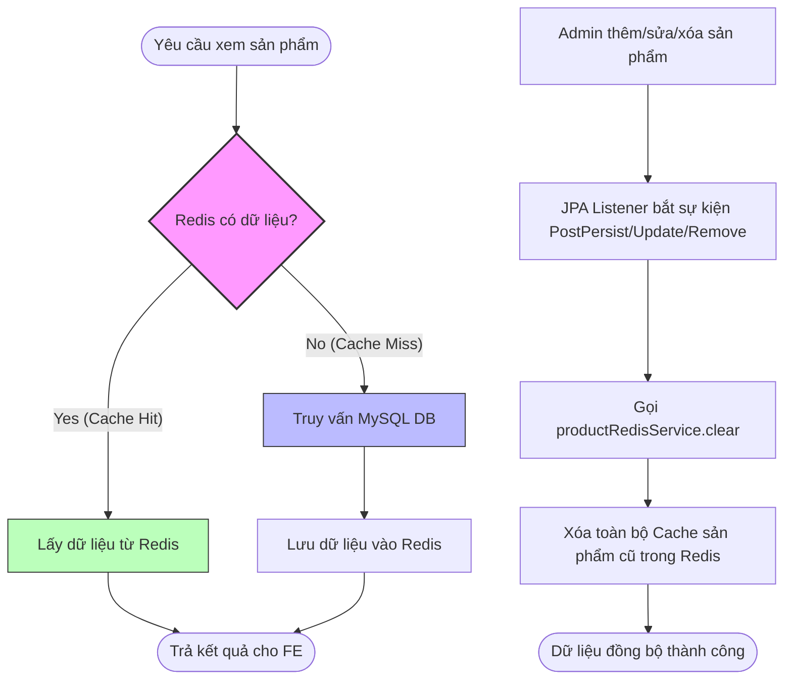
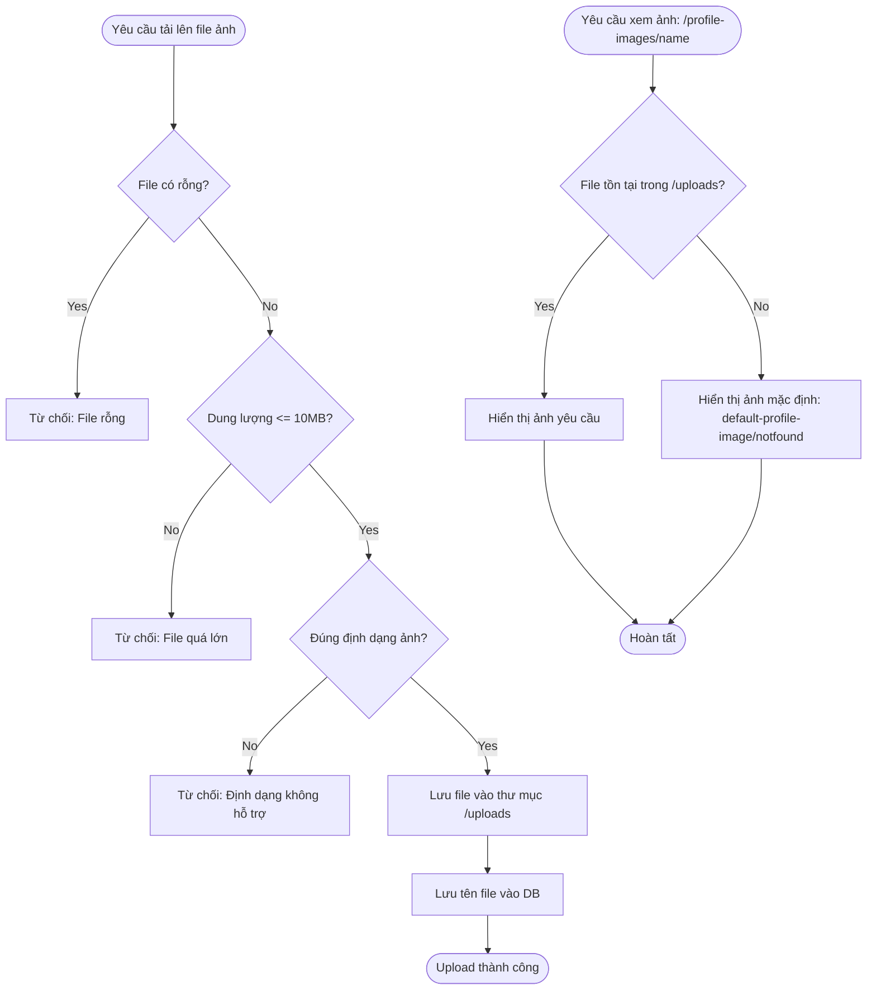
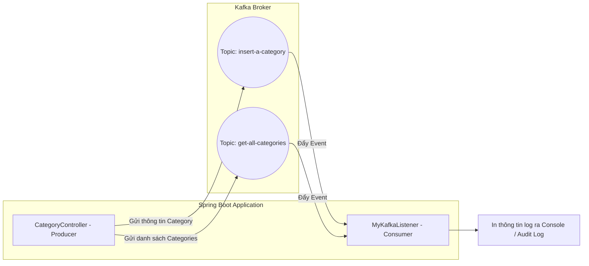

# Tài Liệu Phân Tích Các Luồng Nghiệp Vụ & Kỹ Thuật (E-Commerce App)

Tài liệu này mô tả chi tiết các luồng xử lý chính trong ứng dụng E-Commerce của bạn (bao gồm Angular Frontend và Spring Boot Backend), được minh họa bằng các sơ đồ **Mermaid** trực quan để dễ dàng đọc hiểu và bảo trì.

---

## 1. Luồng Xác Thực & Đăng Nhập Mạng Xã Hội (Authentication & Social Login)

Hệ thống hỗ trợ 2 cơ chế đăng nhập chính: Đăng nhập truyền thống (Username/Password) và Đăng nhập mạng xã hội (Google & Facebook thông qua giao thức OAuth2).

### Mô tả chi tiết luồng Social Login:
1. **Yêu cầu URL xác thực**: Người dùng click vào nút đăng nhập Google/Facebook ở Frontend (FE). FE gửi yêu cầu lên Backend (BE) qua API `/users/auth/social-login?login_type=...`.
2. **Phản hồi URL**: BE tạo ra URL chuyển hướng (Authorization URL) tương ứng với cấu hình OAuth2 Client và trả về cho FE.
3. **Chuyển hướng**: FE điều hướng trình duyệt của người dùng đến trang xin quyền (Consent Screen) của Google/Facebook.
4. **Nhận Authorization Code**: Người dùng đăng nhập và đồng ý cấp quyền. Nhà cung cấp dịch vụ chuyển hướng về địa chỉ Callback của FE (`/auth/google/callback` hoặc `/auth/facebook/callback`) kèm theo tham số `code`.
5. **Trao đổi Code lấy Token**: FE lấy `code` từ URL và gửi yêu cầu POST đến BE qua `/users/auth/social/callback`.
6. **Xác thực & Tạo phiên**: BE sử dụng `code` để trao đổi với Google/Facebook lấy thông tin người dùng. Sau đó, BE tạo tài khoản mới (nếu chưa tồn tại) hoặc đăng nhập tài khoản hiện tại, trả về Access Token (JWT) cùng Refresh Token.
7. **Lưu phiên & Chuyển trang**: FE lưu trữ JWT vào Local Storage, gọi API `/users/details` để lấy thông tin chi tiết tài khoản và chuyển hướng người dùng về trang chủ hoặc trang quản trị.

### Sơ đồ luồng (Sequence Diagram):

---

## 2. Luồng Đặt Hàng & Thanh Toán Cổng VNPay (Checkout & Payment Integration)

Ứng dụng tích hợp cổng thanh toán VNPay (Sandbox) theo cơ chế liên kết động giữa giao dịch thanh toán và đơn hàng thông qua mã tham chiếu `vnp_txn_ref`.

### Mô tả chi tiết:
1. **Tạo URL thanh toán**: Khi người dùng chọn thanh toán bằng VNPay và bấm "Đặt hàng", FE gọi API BE `/payments/create_payment_url` kèm theo số tiền đơn hàng.
2. **Tạo tham chiếu**: BE tạo mã tham chiếu giao dịch ngẫu nhiên gồm 8 chữ số (`vnp_TxnRef`), sinh URL thanh toán VNPay được mã hóa HMAC-SHA512 bằng `secret-key` và trả về cho FE.
3. **Lưu Đơn hàng PENDING**: FE tách tham số `vnp_TxnRef` từ URL thanh toán nhận được, sau đó gửi API POST `/orders` kèm theo thông tin giỏ hàng và `vnp_txn_ref`. BE lưu đơn hàng vào DB với trạng thái ban đầu là `pending`.
4. **Trực quan hóa cổng VNPay**: FE điều hướng người dùng sang trang thanh toán của VNPay Sandbox.
5. **Xử lý Redirect**: Sau khi người dùng nhập thông tin thẻ test và thanh toán thành công, VNPay redirect người dùng về FE thông qua địa chỉ Callback: `/payments/payment-callback?vnp_ResponseCode=00&vnp_TxnRef=...`.
6. **Cập nhật trạng thái**: FE kiểm tra `vnp_ResponseCode === '00'`. Nếu đúng, FE gọi API `/orders/{vnp_TxnRef}/status?status=shipped` để cập nhật trạng thái đơn hàng.
7. **Cơ chế tìm kiếm linh hoạt ở BE**: Khi cập nhật trạng thái, BE gọi `getOrderById(orderId)`. Nếu tìm theo ID khóa chính (Primary Key) thất bại, BE sẽ tự động chuyển sang tìm kiếm đơn hàng theo cột `vnp_txn_ref`. Sau đó lưu cập nhật trạng thái đơn hàng thành `shipped` (đã thanh toán/giao hàng).

### Sơ đồ luồng (Sequence Diagram):

---

## 3. Luồng Quản Lý Cache Sản Phẩm với Redis (Product Caching & Eviction)

Để tối ưu hiệu năng và giảm tải cho Database (MySQL), thông tin danh sách sản phẩm được lưu cache tại Redis. Dữ liệu cache luôn được đồng bộ nhờ cơ chế JPA Entity Lifecycle Listener.

### Mô tả chi tiết:
1. **Truy vấn danh sách (Cache-Aside)**: Khi người dùng xem danh sách sản phẩm, BE sẽ tìm kiếm trong Redis trước.
   - Nếu **Cache Hit** (Có dữ liệu): BE chuyển đổi từ JSON thành đối tượng Java và trả về ngay lập tức.
   - Nếu **Cache Miss** (Chưa có dữ liệu): BE truy vấn DB MySQL, lưu trữ kết quả vào Redis, sau đó trả về cho người dùng.
2. **Đồng bộ khi thay đổi dữ liệu (Eviction)**: Khi Admin thực hiện Thêm, Sửa hoặc Xóa sản phẩm:
   - Các annotation JPA `@PostPersist`, `@PostUpdate`, `@PostRemove` trong `ProductListener` sẽ lắng nghe sự kiện thay đổi.
   - Sự kiện kích hoạt gọi phương thức `productRedisService.clear()` để xóa toàn bộ cache cũ trong Redis.
   - Lần truy vấn sản phẩm tiếp theo sẽ lấy dữ liệu mới nhất từ MySQL và nạp lại vào Redis.

### Sơ đồ luồng (Flowchart):

---

## 4. Luồng Tải Lên & Hiển Thị Hình Ảnh (File Upload & Serving Flow)

Luồng xử lý lưu trữ và hiển thị ảnh đại diện (Profile Image) hoặc ảnh sản phẩm một cách an toàn, kèm theo cơ chế Fallback phòng ngừa lỗi file không tồn tại (500 Error).

### Mô tả chi tiết:
1. **Validate file tải lên**:
   - Kiểm tra định dạng (chỉ cho phép các định dạng ảnh hợp lệ như PNG, JPEG, JPG, WEBP).
   - Kiểm tra dung lượng (không vượt quá 10MB).
2. **Lưu trữ vật lý**: File được đổi tên ngẫu nhiên (UUID) để tránh trùng lặp và lưu trữ vào thư mục `uploads/` trên máy chủ.
3. **Hiển thị hình ảnh & Fallback**:
   - Khi có yêu cầu lấy ảnh (ví dụ `/profile-images/{imageName}`), BE kiểm tra sự tồn tại của file trong thư mục `uploads/`.
   - Nếu file **Tồn tại**: Trả về file ảnh dạng `MediaType.IMAGE_JPEG`.
   - Nếu file **Không tồn tại** (do mất file vật lý hoặc lỗi đường dẫn): Trả về file ảnh mặc định (`default-profile-image.jpeg` hoặc `notfound.jpeg`) để tránh gây ra lỗi 500 cho giao diện người dùng.

### Sơ đồ luồng (Flowchart):

---

## 5. Tích Hợp Hàng Đợi Tin Nhắn Kafka (Kafka Messaging Flow)

Ứng dụng tích hợp Apache Kafka đóng vai trò như một Broker tin nhắn để phục vụ việc giám sát hoạt động hoặc xử lý bất đồng bộ liên quan đến danh mục sản phẩm (Category).

### Mô tả chi tiết:
1. **Nhà sản xuất (Producer)**:
   - Khi Admin thực hiện tạo mới danh mục sản phẩm thông qua API `POST /categories`, Backend sử dụng `KafkaTemplate` gửi một tin nhắn chứa thông tin danh mục đến Topic `insert-a-category`.
   - Khi người dùng lấy danh sách tất cả các danh mục thông qua `GET /categories`, Backend gửi danh sách danh mục đến Topic `get-all-categories`.
2. **Nhà tiêu thụ (Consumer)**:
   - `MyKafkaListener` được cấu hình để lắng nghe các tin nhắn từ cả hai topic `insert-a-category` và `get-all-categories`.
   - Khi nhận được tin nhắn, Kafka Handler tự động phân loại: nếu là một Category riêng lẻ thì gọi phương thức `listenCategory()`, nếu là một danh sách Category thì gọi `listenListOfCategories()`, in log thông tin ra màn hình console để theo dõi/ghi log.

### Sơ đồ luồng (Flowchart):

