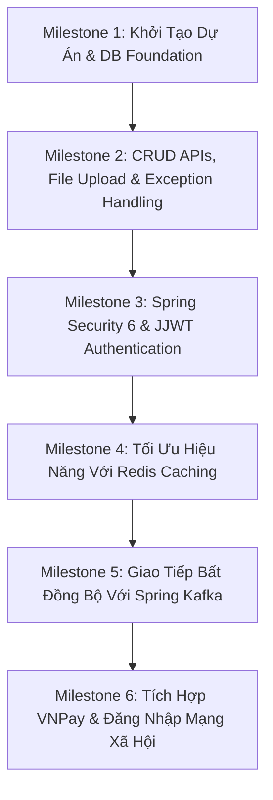
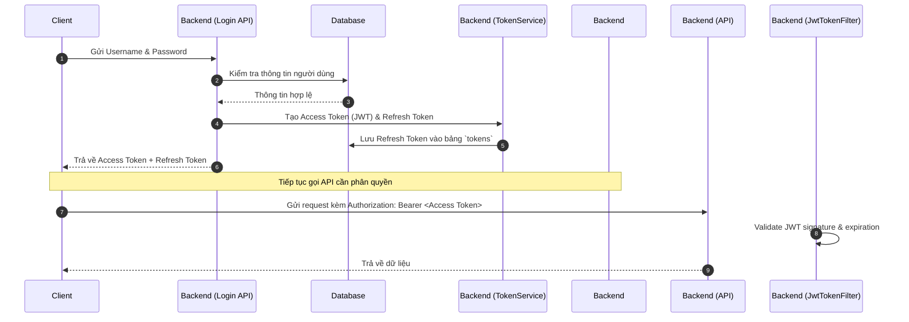

# Lộ Trình Tự Tay Xây Dựng Backend E-Commerce (Spring Boot)

Tài liệu này cung cấp hướng dẫn chi tiết từng bước (Step-by-Step Roadmap) để bạn có thể tự mình xây dựng lại toàn bộ phần Backend của ứng dụng Thương mại Điện tử hiện tại.

---

## 🗺️ Tổng Quan Lộ Trình Học Tập & Thực Hành

Lộ trình được chia làm **6 Cột mốc (Milestones)** lớn, đi từ nền móng cơ bản đến các chức năng nâng cao như Security, Cache, Message Queue và tích hợp cổng thanh toán.



---

## 🛠️ Milestone 1: Khởi Tạo Dự Án & Nền Tảng Database

Mục tiêu của cột mốc này là tạo cấu trúc thư mục chuẩn và thiết lập kết nối cơ sở dữ liệu MySQL sử dụng JPA và Flyway Migration.

### 1. Khởi tạo dự án Spring Boot
- Sử dụng **Spring Initializr** (hoặc tạo qua IDE) với các thông số:
  - **Project:** Maven
  - **Language:** Java 21
  - **Spring Boot version:** `3.3.x`
  - **Dependencies:** `Spring Web`, `Spring Data JPA`, `MySQL Driver`, `Lombok`, `Validation`.
- **Cấu hình file [pom.xml](file:///d:/Desktop/ecom/ecom_be/pom.xml):** Đảm bảo bổ sung các thư viện bổ trợ cần thiết.

### 2. Tổ chức cấu trúc thư mục (Package Structure)
Tạo cấu trúc package trong `src/main/java/com/manh/ecom_be` như sau:
- `configurations/`: Lớp cấu hình (Security, Redis, Kafka, OpenAPI).
- `controllers/`: Nơi định nghĩa các REST Endpoints.
- `services/`: Lớp xử lý logic nghiệp vụ (Business Logic).
- `repositories/`: Giao tiếp với MySQL Database thông qua Spring Data JPA.
- `models/`: Định nghĩa các thực thể (Entities) ánh xạ với bảng DB.
- `dtos/`: Đối tượng truyền nhận dữ liệu từ Client (Data Transfer Objects).
- `responses/`: Định nghĩa dữ liệu trả về cho Client để chuẩn hóa API.
- `exceptions/`: Định nghĩa và xử lý lỗi tùy chỉnh.
- `filters/`: Các bộ lọc request (như JWT Filter).
- `utils/`: Các hàm tiện ích hỗ trợ.

### 3. Thiết kế Database & cấu hình Flyway
- **Mục tiêu:** Quản lý lịch sử thay đổi DB bằng Flyway giúp chạy ứng dụng ở bất kỳ máy nào mà không cần import tay SQL.
- **Thực hành:**
  1. Thêm dependency `flyway-core` và `flyway-mysql` vào `pom.xml`.
  2. Tạo thư mục migration tại `src/main/resources/db/migration`.
  3. Định nghĩa các file migration SQL để tạo các bảng theo thứ tự (ví dụ: `V1__initial_schema.sql` chứa cấu trúc bảng `roles`, `users`, `categories`, `products`, `orders`, `order_details`, `tokens`, `coupons`, `comments`).
  4. Cấu hình thông tin kết nối MySQL và Flyway trong `application.yml`:
     ```yaml
     spring:
       datasource:
         url: jdbc:mysql://localhost:3306/ecom_db?useSSL=false&serverTimezone=UTC
         username: root
         password: your_password
       flyway:
         enabled: true
         baseline-on-migrate: true
     ```

---

## 📦 Milestone 2: CRUD APIs, File Upload & Exception Handling

Xây dựng các API cơ bản để quản lý sản phẩm, danh mục và xử lý các tệp tin tải lên một cách an toàn.

### 1. Viết REST APIs cơ bản với Validation
- Thực hiện các API CRUD cho **Category** và **Product**.
- Sử dụng `@Valid` kết hợp các annotation của Hibernate Validator như `@NotBlank`, `@Size`, `@Min`, `@Max` trong các DTOs (ví dụ: `CategoryDTO`, `ProductDTO`) để kiểm tra tính hợp lệ của dữ liệu đầu vào.
- Trả về cấu trúc response thống nhất cho API (ví dụ: bọc dữ liệu trong một class `ApiResponse<T>`).

### 2. Xử lý Upload Ảnh (Profile & Product Images)
- **Yêu cầu nghiệp vụ:**
  - Giới hạn kích thước file tải lên (ví dụ: tối đa 10MB) để tránh tấn công DOS.
  - Kiểm tra định dạng file (chỉ cho phép ảnh như JPG, PNG) bằng cách sử dụng **Apache Tika** để đọc MIME type thực tế của file thay vì chỉ kiểm tra phần mở rộng đuôi file (tránh trường hợp đổi đuôi file virus `.exe` thành `.jpg`).
  - Đổi tên file sang chuỗi ngẫu nhiên bằng `UUID` để tránh trùng lặp tên trên server.
  - Triển khai cơ chế **Fallback Image**: Khi client yêu cầu một file ảnh không tồn tại trên đĩa vật lý, hệ thống tự động trả về một ảnh mặc định (`default-profile.jpg` hoặc `notfound.jpg`) thay vì trả về lỗi 500 Internal Server Error.

### 3. Bộ Xử lý Lỗi Tập Trung (Global Exception Handler)
- Tạo lớp annotated với `@RestControllerAdvice` (ví dụ: `GlobalExceptionHandler`).
- Sử dụng `@ExceptionHandler` để bắt các ngoại lệ phổ biến như `MethodArgumentNotValidException` (lỗi validation), `DataNotFoundException` (không tìm thấy tài nguyên), và trả về HTTP Status Code phù hợp (400, 404, 500) kèm theo thông báo lỗi rõ ràng cho Frontend.

---

## 🔒 Milestone 3: Spring Security 6 & JJWT Authentication

Xây dựng hệ thống phân quyền nâng cao sử dụng JSON Web Token (JWT) và cơ chế Refresh Token lưu DB.



### 1. Cấu hình Spring Security 6
- Triển khai interface `UserDetailsService` để load thông tin người dùng. Đặc biệt trong ứng dụng này: cấu hình cho phép đăng nhập bằng cả **Số điện thoại (Phone Number)** hoặc **Email** (xem tại [SecurityConfig.java](file:///d:/Desktop/ecom/ecom_be/src/main/java/com/manh/ecom_be/configurations/SecurityConfig.java#L30-L44)).
- Định nghĩa `PasswordEncoder` sử dụng `BCryptPasswordEncoder` để mã hóa mật khẩu người dùng trước khi lưu vào database.

### 2. Tự sinh và cấu hình JWT (JJWT 0.12.5)
- Sử dụng thư viện JJWT mới nhất để tạo lớp tiện ích `JwtTokenUtils`.
- Lớp này có nhiệm vụ:
  - Sinh **Access Token** với các Claims (Subject là Số điện thoại/Email, Roles, Expiration).
  - Ký token bằng thuật toán mã hóa đối xứng (HMAC SHA-256) với mã bí mật (Secret Key) cấu hình từ `application.yml`.
  - Phân tích cú pháp (Parse) và xác thực (Validate) chữ ký cũng như thời hạn của JWT gửi lên từ Client.

### 3. Thiết lập Bộ lọc Request (JwtTokenFilter)
- Tạo lớp kế thừa `OncePerRequestFilter` (xem [JwtTokenFilter.java](file:///d:/Desktop/ecom/ecom_be/src/main/java/com/manh/ecom_be/filters/JwtTokenFilter.java)).
- Logic xử lý trong filter:
  1. Kiểm tra xem URL request có nằm trong danh sách các đường dẫn công khai (**Bypass list** - ví dụ: `/products`, `/categories` với phương thức GET, `/users/login`, `/users/register`, Swagger UI, v.v.). Nếu đúng, bỏ qua bộ lọc và đi tiếp.
  2. Đọc header `Authorization` của Request. Nếu không có hoặc không bắt đầu bằng `"Bearer "`, trả về lỗi 401 Unauthorized.
  3. Trích xuất JWT, lấy ra thông tin định danh (Phone/Email).
  4. Xác thực JWT. Nếu hợp lệ, lấy thông tin User từ cơ sở dữ liệu, tạo đối tượng `UsernamePasswordAuthenticationToken` và đưa vào `SecurityContextHolder` để Spring Security ghi nhận trạng thái đã đăng nhập.

### 4. Triển khai Cơ chế Refresh Token
- Để nâng cao bảo mật, Access Token chỉ nên có thời hạn ngắn (ví dụ: 1 giờ). Khi Access Token hết hạn, client sử dụng Refresh Token để lấy Access Token mới mà không bắt người dùng phải đăng nhập lại.
- **Quy trình:**
  - Tạo bảng `tokens` trong DB để lưu thông tin Refresh Token, thời hạn hết hạn, thiết bị của người dùng, và trạng thái (is revoked/expired).
  - Khi đăng nhập thành công, sinh một chuỗi Refresh Token ngẫu nhiên (UUID), lưu vào DB và trả về kèm với JWT.
  - Viết endpoint `/users/refreshToken` để nhận Refresh Token từ Client, kiểm tra tính hợp lệ trong DB (chưa bị thu hồi, chưa hết hạn) rồi tiến hành cấp lại Access Token mới.

---

## ⚡ Milestone 4: Tối Ưu Hiệu Năng Với Redis Caching

Ứng dụng kỹ thuật Cache-Aside và đồng bộ hóa cache tự động dựa trên JPA Entity Lifecycle.

### 1. Cấu hình Redis Client
- Thêm dependency `spring-boot-starter-data-redis` và `lettuce-core` vào `pom.xml`.
- Cấu hình file `RedisConfig.java` để thiết lập kết nối và định nghĩa `RedisTemplate`. Lưu ý cấu hình serializer để chuyển đổi dữ liệu Java sang dạng JSON khi lưu vào Redis và ngược lại (Deserializer) khi lấy ra.

### 2. Triển khai Chiến lược Cache-Aside (Product List)
- Thay vì truy vấn trực tiếp cơ sở dữ liệu MySQL mỗi khi người dùng tải trang danh sách sản phẩm (vốn rất chậm khi số lượng bản ghi lớn):
  - **Bước 1:** Kiểm tra trong Redis với một Cache Key được tạo động dựa trên các tham số tìm kiếm (page, limit, keyword, categoryId).
  - **Bước 2 (Cache Hit):** Nếu có dữ liệu trong Redis, deserialize chuỗi JSON thành danh sách sản phẩm và trả về ngay lập tức.
  - **Bước 3 (Cache Miss):** Nếu không có trong Redis, thực hiện truy vấn xuống MySQL DB. Lấy được kết quả thì serialize sang JSON và lưu vào Redis kèm theo thời gian hết hạn (TTL - Time to Live, ví dụ: 24 giờ), sau đó trả về cho client.

### 3. Đồng bộ hóa Cache tự động với JPA Entity Lifecycle Listeners
- **Vấn đề:** Khi quản trị viên thêm mới, sửa hoặc xóa sản phẩm trong MySQL, dữ liệu trong Redis Cache sẽ bị cũ (Stale Data).
- **Giải pháp:** Sử dụng cơ chế lắng nghe sự kiện vòng đời của JPA Entity.
  - Tạo class `ProductListener.java` sử dụng các annotation của JPA:
    - `@PostPersist` (Sau khi insert thành công sản phẩm mới).
    - `@PostUpdate` (Sau khi cập nhật thành công sản phẩm).
    - `@PostRemove` (Sau khi xóa thành công sản phẩm).
  - Trong các method này, gọi đến `ProductRedisService` để thực hiện hành động **Xóa toàn bộ cache sản phẩm** (ví dụ: chạy lệnh `redisTemplate.getConnectionFactory().getConnection().serverCommands().flushAll()` hoặc xóa theo pattern key). Việc này đảm bảo ở lần truy vấn kế tiếp, hệ thống sẽ gặp tình trạng Cache Miss và tự động nạp lại dữ liệu mới nhất từ MySQL lên Redis.

---

## ✉️ Milestone 5: Giao Tiếp Bất Đồng Bộ Với Spring Kafka

Sử dụng Message Broker (Apache Kafka) để truyền tải thông tin sự kiện trong hệ thống (Event-driven Architecture).

### 1. Cài đặt hạ tầng cơ sở (Infrastructure)
- Sử dụng Docker Compose (xem file [docker-compose-infra.yml](file:///d:/Desktop/ecom/docker-compose-infra.yml)) để chạy nhanh các dịch vụ MySQL, Redis và Kafka/Zookeeper nội bộ trên máy của bạn.
- Câu lệnh khởi chạy: `docker-compose -f docker-compose-infra.yml up -d`

### 2. Cấu hình Kafka trong Spring Boot
- Thêm dependency `spring-kafka` vào project.
- Thiết lập cấu hình trong [KafkaConfiguration.java](file:///d:/Desktop/ecom/ecom_be/src/main/java/com/manh/ecom_be/configurations/KafkaConfiguration.java):
  - Định nghĩa các Topic cần sử dụng (ví dụ: `"insert-a-category"`, `"get-all-categories"`).
  - Cấu hình Producer: Bộ chuyển đổi dữ liệu gửi đi (Serializer) thành chuỗi JSON.
  - Cấu hình Consumer: Đọc luồng byte dữ liệu nhận được và chuyển ngược lại thành Object tương ứng.

### 3. Viết Producer & Consumer thực tế
- **Producer (Gửi tin nhắn):** Tại `CategoryController`, khi một danh mục được tạo hoặc truy vấn, sử dụng `KafkaTemplate.send(topic, data)` để phát sự kiện bất đồng bộ lên hàng đợi Kafka.
- **Consumer (Nhận tin nhắn):** Tạo một lớp `MyKafkaListener` với các annotation `@KafkaListener` và chỉ định `groupId` hoạt động. Sử dụng `@KafkaHandler` để overload các hàm xử lý dữ liệu tự động tùy thuộc vào kiểu dữ liệu nhận được (ví dụ: in log audit, lưu vết hoạt động của quản trị viên).

---

## 💳 Milestone 6: Tích Hợp VNPay & Đăng Nhập Mạng Xã Hội

Hoàn thiện các tính năng nâng cao phục vụ khách hàng: Thanh toán trực tuyến và Đăng nhập nhanh.

### 1. Tích hợp Cổng thanh toán VNPay
- **Cách thức hoạt động:**
  1. Client gửi yêu cầu thanh toán kèm số tiền.
  2. Backend sinh một mã tham chiếu giao dịch duy nhất (`vnp_TxnRef`) và lưu trạng thái đơn hàng là `pending` cùng mã này vào cơ sở dữ liệu.
  3. Backend tạo ra một URL thanh toán được ký số (Digital Signature - HMAC-SHA512) bằng khóa bí mật (Hash Secret) do VNPay cung cấp. URL này chứa đầy đủ thông tin giao dịch hướng đến trang VNPay Sandbox.
  4. Backend trả URL này về cho Client để Client thực hiện redirect trình duyệt sang cổng thanh toán.
  5. Sau khi người dùng thanh toán trên cổng VNPay, VNPay redirect về URL callback của Frontend kèm theo các tham số kết quả giao dịch (`vnp_ResponseCode`, `vnp_TxnRef`).
  6. Frontend gửi các tham số này lên API của Backend. Backend kiểm tra tính toàn vẹn của chữ ký trả về từ VNPay, nếu thành công (`vnp_ResponseCode == "00"`), Backend tìm đơn hàng theo `vnp_TxnRef` và cập nhật trạng thái đơn hàng thành `shipped` hoặc `delivered`.

### 2. Đăng nhập Mạng xã hội qua Google OAuth2
- Cấu hình Spring Security hỗ trợ OAuth2 Login (`oauth2Login()` và `oauth2ResourceServer()`).
- Sử dụng Google Client ID và Client Secret để xây dựng luồng:
  1. FE yêu cầu Authorization URL từ BE → BE tạo URL dẫn tới trang xác thực của Google.
  2. Người dùng đăng nhập và cấp quyền trên giao diện Google.
  3. Google gửi mã Authorization Code về callback URL của FE.
  4. FE gửi mã này lên BE. BE sử dụng `RestTemplate` hoặc `WebClient` gọi API của Google để đổi lấy thông tin cá nhân (Email, Tên, Ảnh đại diện).
  5. BE tìm kiếm trong DB: Nếu Email này đã tồn tại thì tiến hành đăng nhập trực tiếp; nếu chưa tồn tại thì tự động tạo một tài khoản mới với email này.
  6. Sinh ra cặp JWT + Refresh Token trả về cho client để hoàn tất luồng đăng nhập.

---

## 🚀 Nâng Cấp Backend Độc Lập (Headless Backend Upgrades)

Khi bạn chạy dự án dưới dạng **chỉ có Backend độc lập (API-Only hoặc Headless Backend)**, bạn có thể tích hợp nhiều công nghệ và kỹ thuật nâng cao dành riêng cho lập trình backend để tăng hiệu năng, độ bảo mật và khả năng giám sát hệ thống:

### 1. Bảo vệ tài nguyên & Chống tấn công (Rate Limiting)
- **Mục tiêu:** Ngăn chặn spam request hoặc brute-force mật khẩu.
- **Công nghệ:** Tích hợp thư viện **Bucket4j** kết hợp với Redis hoặc viết một Custom Interceptor sử dụng Redis để đếm số lượng request của một địa chỉ IP trong một khoảng thời gian (ví dụ: tối đa 60 request/phút). Nếu vượt quá, trả về lỗi HTTP 429 Too Many Requests.

### 2. Khoá phân tán chống mua trùng lặp (Distributed Lock với Redisson)
- **Vấn đề:** Khi có hàng ngàn khách hàng mua cùng một mặt hàng có số lượng giới hạn tại cùng một thời điểm (High Concurrency), có thể xảy ra tình trạng "bán vượt mức" (Overselling) do bất đồng bộ dữ liệu.
- **Giải pháp:** Sử dụng **Redisson Distributed Lock** trên Redis. Trước khi trừ số lượng sản phẩm trong kho DB, Service phải giành được Lock tương ứng với ID sản phẩm đó. Chỉ một luồng được xử lý tại một thời điểm, đảm bảo tính nhất quán dữ liệu tuyệt đối.

### 3. Tự động kiểm toán dữ liệu (Spring Data JPA Auditing & Soft Delete)
- **JPA Auditing:** Cấu hình tự động cập nhật ngày tạo, ngày sửa, người tạo, người sửa cho tất cả các bảng mà không cần gán thủ công bằng cách sử dụng `@CreatedDate`, `@LastModifiedDate`, `@CreatedBy` kết hợp với `AuditorAware` (lấy từ Security Context).
- **Soft Delete (Xóa mềm):** Thay vì xóa hẳn bản ghi ra khỏi Database (`DELETE FROM...`), thêm cột `deleted` (kiểu boolean). Sử dụng các annotation của Hibernate như `@SQLDelete` (chuyển đổi lệnh DELETE thành lệnh UPDATE set `deleted = true`) và `@SQLRestriction("deleted = false")` để tự động lọc bỏ các bản ghi đã xóa khi truy vấn.

### 4. Giám sát hệ thống toàn diện (Actuator + Prometheus + Grafana)
- Cấu hình **Spring Boot Actuator** để cung cấp các metrics về tài nguyên hệ thống (CPU, RAM, số lượng connection pool, thời gian phản hồi của API).
- Cấu hình để xuất dữ liệu metrics dưới dạng định dạng của **Prometheus**.
- Dùng Docker Compose khởi chạy Prometheus để cào (scrape) các metrics đó, rồi kết nối với **Grafana** để vẽ các biểu đồ giám sát (Dashboard) trực quan theo thời gian thực.

### 5. Xử lý tác vụ nặng ở nền (Async Tasks với Spring Mail & @Async)
- Khi người dùng đăng ký hoặc đặt hàng thành công, hệ thống cần gửi Email xác nhận. Việc kết nối với máy chủ SMTP của Google để gửi mail mất từ 2-3 giây. Nếu xử lý đồng bộ, người dùng sẽ phải đợi rất lâu mới nhận được phản hồi.
- **Giải pháp:** Sử dụng annotation `@EnableAsync` và `@Async` trên method gửi email của `EmailService`. Luồng xử lý HTTP sẽ trả về phản hồi 200 OK ngay lập tức cho client, trong khi một luồng khác trong Thread Pool của Spring Boot sẽ tự đảm nhận việc gửi email ở nền.

---

## 📝 Kế Hoạch Thực Hành Cho Bạn

Để học tốt và nắm vững phần backend này, hãy làm theo phương pháp **"Xây dựng từng lớp" (Layer-by-Layer)**:

1. **Bước 1 (Đọc & Phân Tích):** Đọc kỹ tài liệu luồng xử lý tại file [application_flows.md](file:///d:/Desktop/ecom/application_flows.md) để hình dung cách dữ liệu di chuyển giữa Frontend và Backend.
2. **Bước 2 (Khởi tạo DB):** Tạo một cơ sở dữ liệu trống, chạy file `docker-compose-infra.yml` để khởi động MySQL, Redis, Kafka.
3. **Bước 3 (Thực hành Code):** Hãy tạo một project Spring Boot hoàn toàn mới ở một thư mục khác bên ngoài workspace này. Tiến hành làm theo thứ tự từ **Milestone 1** đến **Milestone 6**. Khi gặp khó khăn ở milestone nào, hãy mở code của dự án hiện tại (`ecom_be`) ra để tham chiếu và đối chiếu cách cấu hình cũng như cách viết code.
4. **Bước 4 (Đặt câu hỏi):** Trong quá trình tự code, nếu bạn không hiểu bất cứ dòng code nào, hoặc gặp lỗi biên dịch/lỗi logic, hãy hỏi tôi ngay. Tôi sẽ giải thích chi tiết cơ chế hoạt động của dòng code đó cho bạn.
